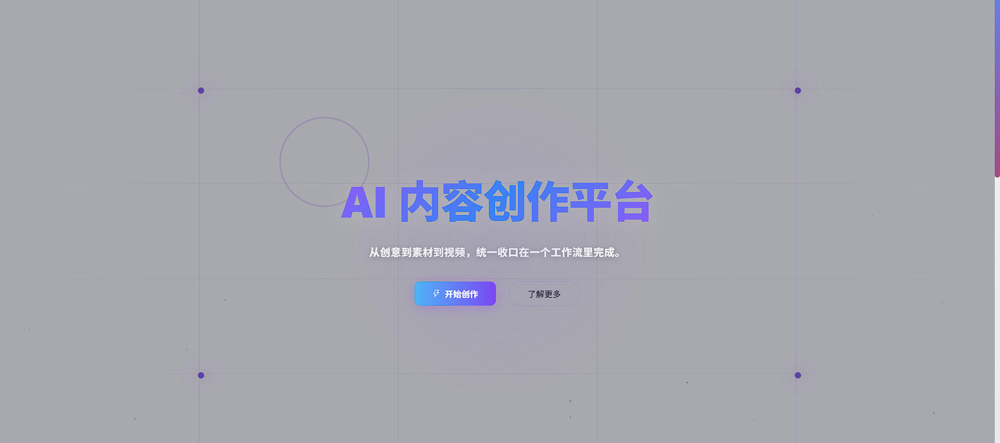

# AI 漫剧工作台 | AI 短剧生成 | 小说转视频 | 开源漫剧制作工具

> 🎬 **从小说到短剧，一站式 AI 漫剧创作平台** | 支持文本生成、分镜设计、图像生成、视频制作全流程

[](https://hub.docker.com/r/paopaoyuy/ai-comic-web)
[](https://github.com/yy18570728781/AI-Comic-Director)
[](./LICENSE)

---


1. **本地部署使用**（推荐）
   ```bash
   git clone https://github.com/yy18570728781/AI-Comic-Director.git
   cd AI-Comic-Director
   docker-compose up -d
   # 访问 http://localhost:3005
   ```

2. **等待服务恢复**
   - 我们会在 GitHub 和交流群第一时间通知恢复进度
   - 请关注本项目的 Issues 和 Releases

**安全提醒：**

- 🔒 请定期备份您的重要数据
- 🔒 建议使用本地部署，数据更安全
- 🔒 不要在公网暴露未加固的服务

**联系我们：**

- 📧 邮箱：yy18570728781@163.com
- 💬 微信：wslyy3399
- 💬 交流群：见下方二维码

我们对此次事件给您带来的不便深表歉意，感谢您的理解和支持！

---

**最新进展：** 请关注 [GitHub Issues](https://github.com/yy18570728781/AI-Comic-Director/issues) 获取实时更新

---

## 🎯 为什么选择 AI 漫剧工作台？

### 传统漫剧制作的痛点

❌ **人工成本高** - 编剧、分镜师、画师、剪辑师，团队成本动辄数万
❌ **制作周期长** - 一集 3 分钟短剧，传统流程需要 1-2 周
❌ **技术门槛高** - 需要掌握 Photoshop、Premiere、After Effects 等专业软件
❌ **素材难获取** - 角色一致性难保证，场景素材需要大量采购

### AI 漫剧工作台的解决方案

✅ **AI 全流程自动化** - 从小说到视频，AI 自动完成 80% 工作
✅ **10 分钟出片** - 输入小说大纲，10 分钟生成完整分镜视频
✅ **零技术门槛** - 网页操作，无需专业软件，小白也能用
✅ **角色一致性保证** - AI 角色库，确保同一角色在不同镜头中保持一致
✅ **成本降低 90%** - 无需雇佣团队，按需使用 AI 服务

---

## 🚀 快速开始

### 💻 在线体验（无需安装）

立即访问在线版，无需下载，随时开始使用：

🌐 **[立即体验 AI 漫剧工作台](http://paopaomj.yjaippt.top/)**

> 💡 推荐直接使用在线版，始终保持最新功能，无需维护

---

### 🐳 本地部署（推荐开发者）

#### 首次部署

```bash
# 1. 克隆项目
git clone https://github.com/yy18570728781/AI-Comic-Director.git
cd AI-Comic-Director

# 2. 启动服务
# 首次启动时会自动拉取所需官方镜像
docker-compose up -d

# 3. 访问应用
# 浏览器打开 http://localhost:3005
```

**访问地址：** [http://localhost:3005](http://localhost:3005)

#### 常用命令

```bash
# 查看日志
docker-compose logs -f

# 停止服务
docker-compose down

# 重启服务
docker-compose restart
```

#### 更新到最新版本

```bash
# 拉取最新镜像并重建容器
docker-compose pull
docker-compose up -d --force-recreate
```

---

## 🎬 功能演示

### 1️⃣ 小说生成 → 剧本转换

AI 自动将小说转换为结构化剧本，智能提取角色、场景、对话


### 2️⃣ 剧本管理

剧本列表管理，支持新建 编辑 删除，一键转换为分镜脚本


### 3️⃣ 智能分镜设计

AI 自动拆分剧本为分镜脚本，生成镜头号、画面描述、提示词, 一键绑定角色


### 4️⃣ 角色场景生成

AI 生成一致性角色形象和场景背景，保存到资源库


### 5️⃣ 首页概览

一站式 AI 漫剧创作平台，从小说到视频的全流程工具



### 6️⃣ 创作工作台

智能分镜设计，AI 自动拆分剧本为分镜脚本


### 7️⃣ 图生图功能

AI 图像生成，支持文生图、图生图、图像融合


### 8️⃣ 图生视频功能

批量生成视频，自动合成完整短剧


---

## ✨ 核心功能

### 📝 AI 内容创作

- ✅ **小说生成** - 根据主题/大纲生成完整小说
- ✅ **剧本转换** - 小说自动转换为结构化剧本
- ✅ **分镜脚本** - AI 自动生成详细分镜（镜头号、画面描述、提示词）
- ✅ **提示词优化** - 智能优化图像和视频生成提示词

### 🎨 AI 视觉生成

- ✅ **角色生成** - AI 生成一致性角色形象
- ✅ **场景生成** - AI 生成场景背景
- ✅ **图像生成** - 支持文生图、图生图、图像融合
- ✅ **视频生成** - 支持图生视频、文生视频

### 🎞️ 智能制作工具

- ✅ **角色库管理** - 保存角色 ID，确保人物一致性
- ✅ **资源库管理** - 永久保存生成的图像和视频
- ✅ **批量生成** - 一键批量生成所有分镜
- ✅ **实时预览** - 实时查看生成进度和结果

### 🤖 支持的 AI 模型

- **文本生成** - DeepSeek、OpenAI GPT、豆包
- **图像生成** - Stable Diffusion、DALL-E、Midjourney
- **视频生成** - Sora、Vidu、Runway、Luma

---

## 🎯 适用场景

### 📱 短视频创作者

- 快速生成短剧内容，日更不是梦
- 降低制作成本，提高产出效率
- 适合抖音、快手、视频号等平台

### 📚 网文作者

- 将小说改编为漫剧，扩大影响力
- 多渠道变现，增加收入来源
- 吸引更多读者关注

### 🎬 MCN 机构

- 批量生产短剧内容
- 降低人力成本
- 提高内容产出效率

### 🏢 企业营销

- 快速制作产品宣传短剧
- 降低营销成本
- 提高传播效果

---

## 💰 使用成本

### 免费试用

- ✅ 完整功能体验
- ✅ 无需科学上网

## 🔧 常用命令

```bash
# 查看运行状态
docker-compose ps

# 查看日志
docker-compose logs -f

# 停止服务
docker-compose down

# 重启服务
docker-compose restart
```

### 端口配置

默认端口是 `3005`，如果需要修改，编辑 `docker-compose.yml`：

```yaml
ports:
  - "8080:80"  # 改为 8080 端口
```

### 故障排查

#### 问题 1：端口被占用

```bash
# Windows 查看端口占用
netstat -ano | findstr :3005

# Linux/Mac 查看端口占用
lsof -i :3005

# 修改为其他端口（编辑 docker-compose.yml）
```

#### 问题 2：无法访问

```bash
# 检查容器是否运行
docker-compose ps

# 查看容器日志
docker-compose logs

# 重启容器
docker-compose restart
```

#### 问题 3：API 请求失败

前端会自动连接到后端服务，请确保：

- ✅ 网络连接正常
- ✅ 没有代理或防火墙拦截

---

## 📖 使用教程

### 第一步：创建项目

1. 点击"新建项目"
2. 输入项目名称和描述
3. 选择项目类型（小说、剧本、分镜）

### 第二步：生成内容

1. 输入小说主题或大纲
2. AI 自动生成完整小说
3. 一键转换为剧本和分镜

### 第三步：生成素材

1. AI 自动提取角色和场景
2. 批量生成角色形象和场景背景
3. 保存到资源库

### 第四步：生成视频

1. 为每个分镜添加参考图
2. 批量生成视频
3. 下载或在线预览

---

## 🤝 商业合作

### 个人使用（免费）

- ✅ 学习、研究、个人创作
- ✅ 非商业用途
- ✅ 遵守 AGPL-3.0 协议

### 商业授权（闭源商用）

- 💼 **闭源商用授权** - 如需闭源商用、去除 AGPL 开源义务，请联系作者
- 💼 **企业定制** - 定制开发、私有化部署
- 💼 **技术支持** - 7x24 小时技术支持

### 联系方式

- 📧 **邮箱** - yy18570728781@163.com
- 💬 **微信** - yy18570728781
- 🌐 **在线体验** - [http://paopaomj.yjaippt.top](http://paopaomj.yjaippt.top)

#### **补充说明：**

考虑到很多用户可能不会代码都是使用者居多 本项目当前公开代码主要开源前端代码，docker一键本地部署前端即用，开发者可基于现有前端自行接入适合自己的后端能力。后端后续考虑开源中 等搭建好了自己聚合api平台后会考虑开放 因为作者目前没有团队是一个人开发 所以开发缓慢 同时也会考虑后续自己的温饱问题（本人现在是失业状态，希望能够理解支持）

#### 交流群

欢迎扫码加入交流群：


---

### 模型支持

- 🤖 **模型全** - 支持 20+ 主流 AI 模型
- 🔄 **自动切换** - 模型故障自动切换备用
- 📊 **实时监控** - 实时查看生成进度和状态

---

## 🔗 相关链接

- � [在线体验](http://paopaomj.yjaippt.top/) - 无需安装，立即使用
- �🏠 [项目主页](https://github.com/yy18570728781/AI-Comic-Director)
- 📦 [Docker Hub](https://hub.docker.com/r/paopaoyuy/ai-comic-web)
- 📖 [使用文档](https://github.com/yy18570728781/AI-Comic-Director#readme)
- 💬 [问题反馈](https://github.com/yy18570728781/AI-Comic-Director/issues)

---


## 📄 开源协议

本文档旨在明确本项目的开源范围、共建规则、授权约束及合作方式，兼顾社区共建的开放性与核心权益的保护性。

### 一、开源范围说明

当前仓库主要开放的是前端代码与部署文档，包含界面、交互、组件、前端逻辑、多语言适配、样式优化等内容。

后端部分更多承担的是 **第三方大模型服务对接、任务调度与业务编排** 这类能力，开发者可以根据自己的业务场景、模型平台和部署方式，自行实现或接入自己的后端服务。

**补充说明：**
考虑到很多用户可能不会代码都是使用者居多 本项目当前公开代码主要开源前端代码，docker一键本地部署前端即用，开发者可基于现有前端自行接入适合自己的后端能力。后端后续考虑开源中 等搭建好了自己聚合api平台后会考虑开放 因为作者目前没有团队是一个人开发 所以开发缓慢 同时也会考虑后续自己的温饱问题（本人现在是失业状态，希望能够理解支持）

### 二、开源协议与授权约束

本项目前端代码基于 **AGPL-3.0** 协议开源，所有使用者、开发者需遵守以下规则：

1. 非商用用途：
   允许个人学习、修改、部署和使用，但需保留原作者版权声明与协议说明。
2. 网络服务场景：
   如果你基于本项目前端代码进行修改，并通过网站、SaaS、在线工具等方式对外提供服务，必须按照 AGPL-3.0 要求公开对应的修改后源码。
3. 闭源商用：
   如需闭源商用、去除 AGPL 开源义务，请联系作者获取商业授权。
4. 侵权追责：
   对于未经授权闭源商用、恶意去署名分发等行为，原作者保留投诉、要求下架及依法追责的权利。

### 三、社区共建规则

欢迎围绕前端部分参与共建：

- 共建范围：界面交互优化、BUG 修复、多语言补充、兼容性适配、前端新功能开发、样式美化等。
- 参与方式：Fork 仓库后基于 `develop` 分支开发，完成后提交 PR。
- 提交要求：提交前请确保代码规范、逻辑清晰、关键逻辑保留中文注释，并符合项目整体风格。
- 重大功能优化：建议先通过 Issues 与原作者沟通确认方向，避免重复开发。

### 四、权限与贡献说明

- 普通开发者：可提交 PR，经原作者审核通过后合并。
- 核心共建者：长期贡献且代码质量稳定的开发者，可申请前端 Collaborator 权限。
- 贡献认可：所有被合并的有效 PR，都会纳入项目贡献记录。

### 五、合作与沟通方式

- 商业授权 / 私有化部署 / 深度合作：请联系原作者单独沟通。
- 前端共建相关问题：欢迎通过 GitHub Issues 或仓库讨论区交流。
- 禁止基于本项目公开代码恶意复刻竞品；若有联合开发、功能互补等合作意愿，请先联系协商。

### 六、免责声明

- 当前开源前端代码仅提供基础界面与接口对接能力，无后端支持时无法实现完整核心功能。
- 使用、修改、分发本项目代码带来的任何风险或损失，由使用者自行承担。
- 所有参与共建的开发者需确保提交内容无版权纠纷、无恶意代码，否则由提交者自行承担责任。
- 原作者保留对项目开源范围、协议条款、共建规则的最终解释权，并可根据项目发展进行调整。

---

## 📞 联系我们

### 技术支持

- 📧 **邮箱** - yy18570728781@163.com
- 💬 **微信** - wslyy3399

### 商务合作

- 📧 **邮箱** - yy18570728781@163.com
- 📞 **电话** - 18570728781

---

<div align="center">

**⭐ 如果这个项目对你有帮助，请给个 Star！⭐**

[🌐 在线体验](http://paopaomj.yjaippt.top/) | [📖 查看文档](https://github.com/yy18570728781/AI-Comic-Director#readme) | [💬 问题反馈](https://github.com/yy18570728781/AI-Comic-Director/issues) | [📧 联系我们](mailto:yy18570728781@163.com)

</div>

---

## Star History

[](https://www.star-history.com/#yy18570728781/AI-Comic-Director&Date)

---

## 🔍 SEO 关键词

AI 漫剧 | AI 短剧生成 | 小说转视频 | 漫剧制作工具 | AI 视频生成 | 短剧创作 | 文生视频 | 图生视频 | AI 导演 | 自动分镜 | 角色一致性 | 场景生成 | 批量生成 | 短视频制作 | 抖音短剧 | 快手短剧 | 视频号短剧 | MCN 工具 | 网文改编 | AI 创作工具

---

<div align="center">
<sub>Built with ❤️ by AI Comic Studio Team</sub>
</div>
